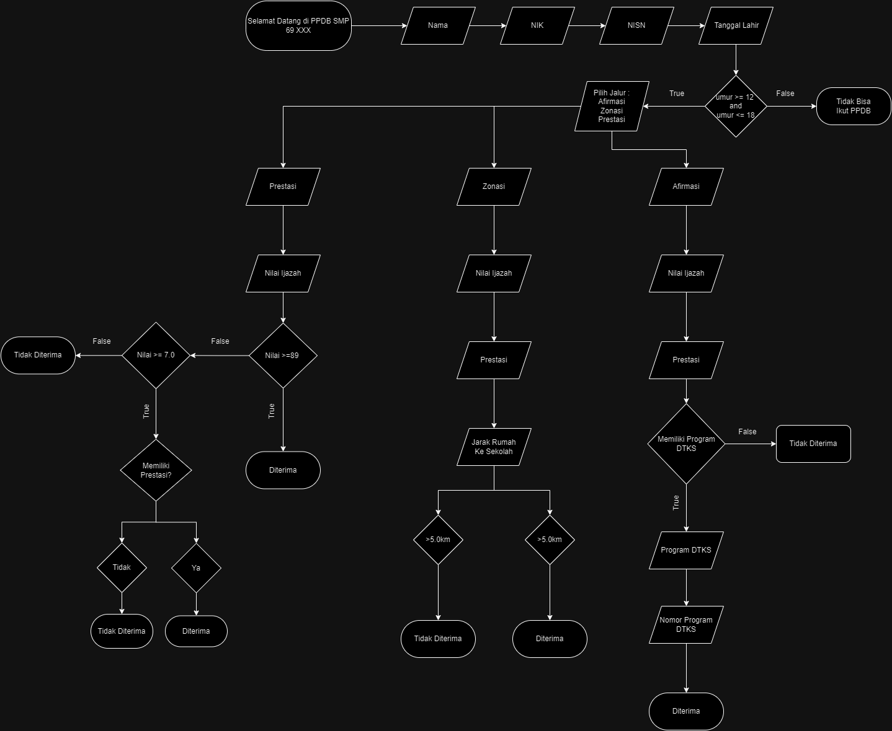

# Program PPDB SMP 69 XXX 2024

## Studi Kasus
    SMP 69 XXX 2024 membuka PPDB tahun ajaran 2024/2025 dengan syarat pendaftar harus berumur lebih dari 12 tahun dan kurang dari 17 tahun.

    Terdapat 3 jalur pendaftaran disini, yaitu sebagai berikut :

    1. Afirmasi
        Program bantuan untuk siswa siswi yang berasal dari keluarga kurang mampu
        syarat untuk lolos jalur afirmasi
        1. Memiliki program DTKS seperti KIP, KKS, KPS, dan PKH
        2. Nilai >= 7.2

    2. Zonasi
        Jalur PPDB untuk siswa siswi yang rumahnya dekat dengan SMP 69 XXX
        syarat untuk lolos jalur zonasi
        1. Jarak rumah ke SMP 69 XXX >= 5.0 km
        2. Jika jarak rumah > 5.0 km dan <= 8.0, maka nilai harus >= 7.2

    3. Prestasi
        Jalur PPDB untuk siswa siswi berprestasi
        syarat untuk lolos jalur prestasi
        1. Nilai >= 8.9
        2. Jika nilai <8.9 dan >= 7.0, maka harus memiliki satidaknya 1 prestasi

## Flowchart
